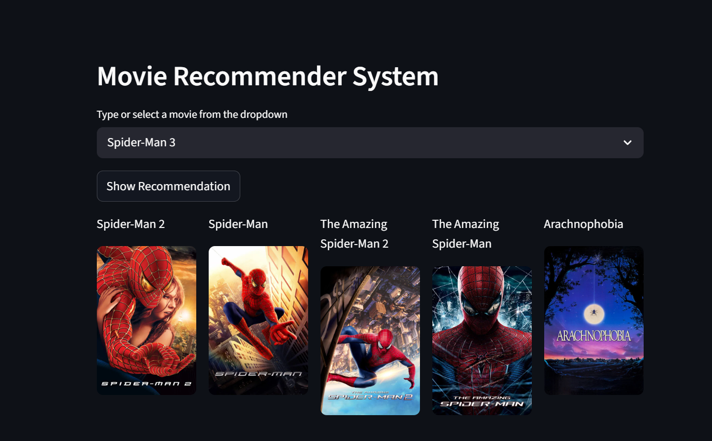

# 🎬 Movie Recommender System

A content-based movie recommendation system built with Python and Streamlit that suggests similar movies based on your selection using cosine similarity.

---

## 📸 Demo

> Select a movie from the dropdown and get 5 similar movie recommendations with posters fetched live from TMDB.



---

## 🚀 Features

- 🔍 Search and select from thousands of movies
- 🎯 Content-based filtering using cosine similarity
- 🖼️ Live movie posters fetched from TMDB API
- ⚡ Simple and clean Streamlit UI

---

## 🛠️ Tech Stack

| Technology | Purpose |
|---|---|
| Python | Core language |
| Streamlit | Web app framework |
| Scikit-learn | Cosine similarity & vectorization |
| Pandas | Data manipulation |
| Requests | TMDB API calls |
| Pickle | Model serialization |
| TMDB API | Fetching movie posters |

---

## 📁 Project Structure

```
movie_recommendation_system/
│
├── app.py                  # Main Streamlit app
├── movie_recommender.ipynb # Jupyter notebook (EDA + model building)
├── movies.pkl              # Preprocessed movies dataframe
├── similarity.pkl          # Precomputed cosine similarity matrix
├── requirements.txt        # Python dependencies
└── README.md               # Project documentation
```

---

## ⚙️ How It Works

1. **Data Preprocessing** — Movie metadata (genres, cast, crew, keywords) is combined into a single `tags` column
2. **Vectorization** — Tags are converted into vectors using `CountVectorizer`
3. **Similarity Matrix** — Cosine similarity is computed between all movie vectors
4. **Recommendation** — Top 5 most similar movies are returned for any selected movie
5. **Poster Fetching** — Movie posters are fetched in real-time using the TMDB API

---

## 🔧 Setup & Installation

### 1. Clone the repository
```bash
git clone https://github.com/your-username/movie-recommender-system.git
cd movie-recommender-system
```

### 2. Install dependencies
```bash
pip install -r requirements.txt
```

### 3. Get a TMDB API Key
- Go to [themoviedb.org](https://www.themoviedb.org/)
- Create a free account
- Navigate to **Settings → API → Create → Developer**
- Copy your **API Key (v3 auth)**

### 4. Add your API key in `app.py`
```python
url = "https://api.themoviedb.org/3/movie/{}?api_key=YOUR_API_KEY&language=en-US".format(movie_id)
```

### 5. Run the app
```bash
streamlit run app.py
```

---

## 📦 Requirements

```
streamlit
requests
pandas
numpy
scikit-learn
```

Install all at once:
```bash
pip install -r requirements.txt
```

---

## 📊 Dataset

This project uses the **TMDB 5000 Movie Dataset** available on Kaggle:
- `tmdb_5000_movies.csv`
- `tmdb_5000_credits.csv`

> Dataset link: [TMDB 5000 Movie Dataset](https://www.kaggle.com/datasets/tmdb/tmdb-movie-metadata)

---

## 🙋‍♀️ Author

**Riya Jha**  
---

## 📄 License

This project is open source and available under the [MIT License](LICENSE).
